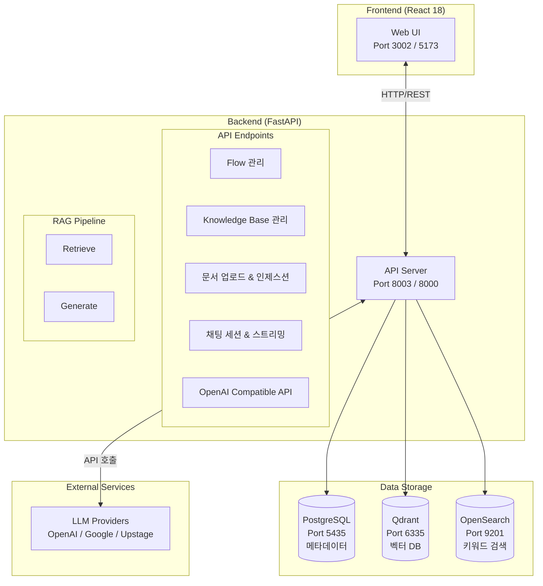
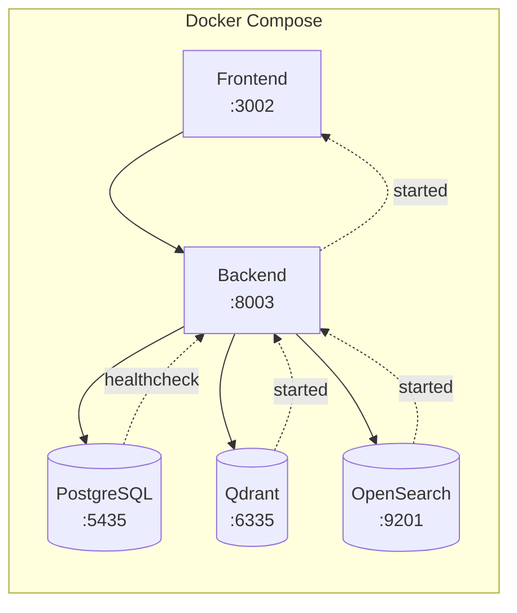
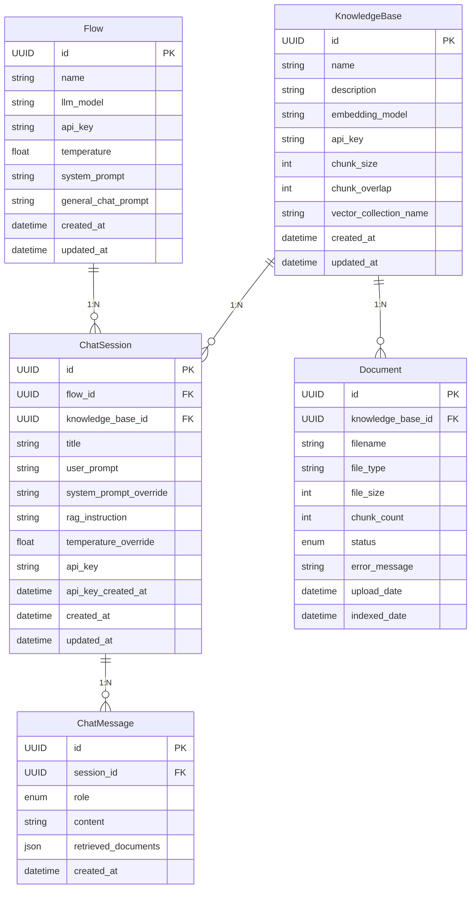
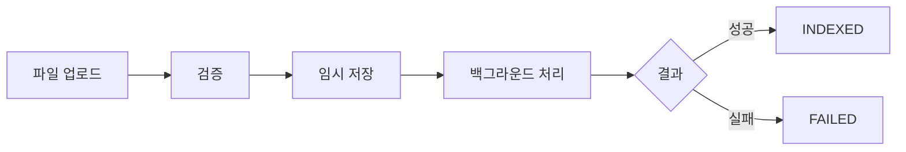
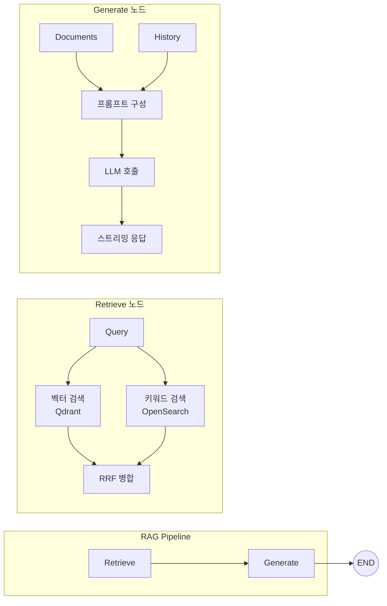
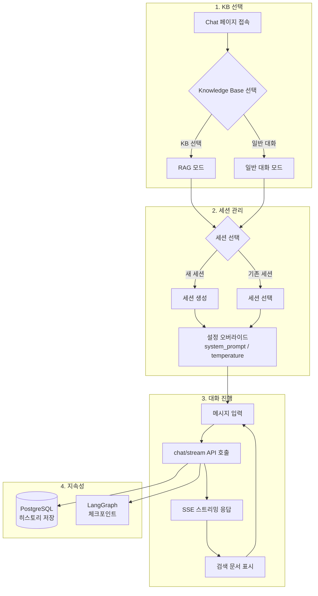
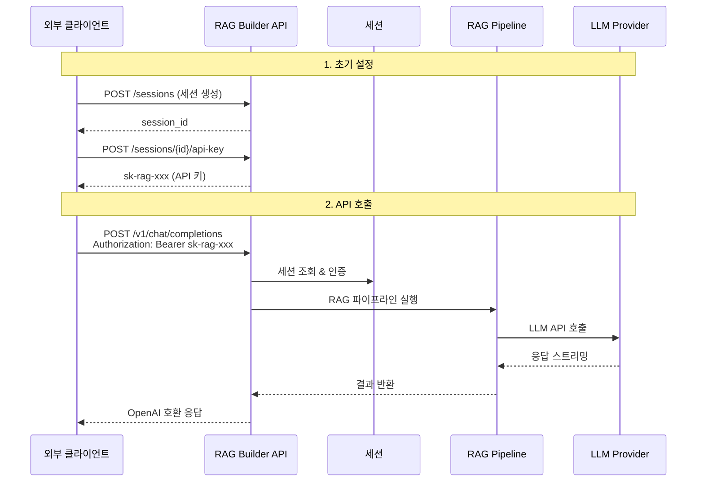

> 문서 버전: 1.0
최종 수정일: 2025-11-28
> 

---

## 목차

1. [개요](about:blank#1-%EA%B0%9C%EC%9A%94)
2. [시스템 아키텍처](about:blank#2-%EC%8B%9C%EC%8A%A4%ED%85%9C-%EC%95%84%ED%82%A4%ED%85%8D%EC%B2%98)
3. [데이터 모델](about:blank#3-%EB%8D%B0%EC%9D%B4%ED%84%B0-%EB%AA%A8%EB%8D%B8)
4. [API 명세](about:blank#4-api-%EB%AA%85%EC%84%B8)
5. [핵심 기능 상세](about:blank#5-%ED%95%B5%EC%8B%AC-%EA%B8%B0%EB%8A%A5-%EC%83%81%EC%84%B8)
6. [프론트엔드 구조](about:blank#6-%ED%94%84%EB%A1%A0%ED%8A%B8%EC%97%94%EB%93%9C-%EA%B5%AC%EC%A1%B0)
7. [설정 및 환경 변수](about:blank#7-%EC%84%A4%EC%A0%95-%EB%B0%8F-%ED%99%98%EA%B2%BD-%EB%B3%80%EC%88%98)
8. [지원 모델 및 형식](about:blank#8-%EC%A7%80%EC%9B%90-%EB%AA%A8%EB%8D%B8-%EB%B0%8F-%ED%98%95%EC%8B%9D)

---

## 1. 개요

### 1.1 프로젝트 소개

RAG Builder는 **Retrieval-Augmented Generation (RAG)** 파이프라인을 구축하고 관리하기 위한 풀스택 오픈소스 애플리케이션입니다. 웹 기반 GUI를 통해 문서 관리, LLM 모델 설정, 컨텍스트 인식 대화를 수행할 수 있습니다.

### 1.2 핵심 기능 요약

| 기능 | 설명 |
| --- | --- |
| **RAG Flow 관리** | LLM 모델, API 키, 시스템 프롬프트 설정 |
| **Knowledge Base** | 문서 컬렉션 생성 및 임베딩 설정 |
| **문서 업로드** | PDF, TXT, MD, DOCX 파일 처리 |
| **하이브리드 검색** | 벡터 검색 + 키워드 검색 (RRF 알고리즘) |
| **채팅 세션** | RAG 기반 대화 및 일반 대화 지원 |
| **OpenAI Compatible API** | 외부 통합용 OpenAI SDK 호환 API |

### 1.3 기술 스택

| 레이어 | 기술 | 용도 |
| --- | --- | --- |
| **프론트엔드** | React 18 + TypeScript + Vite | 웹 UI |
| **상태 관리** | Zustand | 클라이언트 상태 |
| **UI 라이브러리** | Tailwind CSS + Shadcn/UI | 스타일링 |
| **백엔드** | FastAPI (Python 3.11+) | REST API, 스트리밍 |
| **RAG 프레임워크** | LangGraph + LangChain | RAG 파이프라인 오케스트레이션 |
| **메타데이터 DB** | PostgreSQL 15 | 메타데이터, 세션, 메시지 |
| **벡터 DB** | Qdrant | 벡터 검색, 임베딩 저장 |
| **키워드 검색** | OpenSearch 2.11 | BM25 키워드 검색 |
| **컨테이너** | Docker Compose | 서비스 오케스트레이션 |

---

## 2. 시스템 아키텍처

### 2.1 전체 시스템 구성도



### 2.2 서비스 구성 (Docker Compose)

| 서비스 | 이미지 | 외부 포트 | 내부 포트 | 볼륨 | 용도 |
| --- | --- | --- | --- | --- | --- |
| postgres | postgres:15-alpine | 5435 | 5432 | postgres_data | 메타데이터 저장 |
| qdrant | qdrant/qdrant:latest | 6335 | 6333 | qdrant_data | 벡터 저장 |
| opensearch | opensearchproject/opensearch:2.11.0 | 9201 | 9200 | opensearch_data | 키워드 검색 |
| backend | FastAPI 앱 | 8003 | 8000 | backend, backend_cache | API 서버 |
| frontend | React 앱 | 3002 | 5173 | frontend | 웹 UI |

**서비스 의존성:**



### 2.3 네트워크 구성

- **네트워크명**: `rag-network` (bridge)
- **서비스 간 통신**: 컨테이너 이름으로 내부 통신
    - Backend → PostgreSQL: `postgres:5432`
    - Backend → Qdrant: `qdrant:6333`
    - Backend → OpenSearch: `opensearch:9200`

---

## 3. 데이터 모델

### 3.1 엔티티 관계도 (ERD)



### 3.2 Flow (LLM 설정)

LLM 모델 설정을 관리하는 엔티티입니다.

| 필드 | 타입 | 설명 | 기본값 |
| --- | --- | --- | --- |
| `id` | UUID | 기본 키 | auto |
| `name` | string | Flow 이름 (인덱스) | 필수 |
| `llm_model` | string | LLM 모델명 | “gpt-4o-mini” |
| `api_key` | string (nullable) | LLM API 키 | null |
| `temperature` | float | 응답 창의성 (0.0-2.0) | 0.7 |
| `system_prompt` | string | RAG 대화용 시스템 프롬프트 | “You are a helpful assistant.” |
| `general_chat_prompt` | string (nullable) | 일반 대화용 시스템 프롬프트 | null |
| `created_at` | datetime | 생성 시간 | auto |
| `updated_at` | datetime | 수정 시간 | auto |

### 3.3 KnowledgeBase (문서 컬렉션)

문서 컬렉션과 임베딩 설정을 관리하는 엔티티입니다.

| 필드 | 타입 | 설명 | 기본값 |
| --- | --- | --- | --- |
| `id` | UUID | 기본 키 | auto |
| `name` | string | Knowledge Base 이름 | 필수 |
| `description` | string (nullable) | 설명 | null |
| `embedding_model` | string | 임베딩 모델명 | 필수 |
| `api_key` | string (nullable) | 임베딩 API 키 | null |
| `chunk_size` | int | 청크 크기 | 1000 |
| `chunk_overlap` | int | 청크 오버랩 | 200 |
| `vector_collection_name` | string | Qdrant 컬렉션명 (고유) | 필수 |
| `created_at` | datetime | 생성 시간 | auto |
| `updated_at` | datetime | 수정 시간 | auto |

### 3.4 Document (업로드 문서)

업로드된 문서의 메타데이터를 저장합니다.

| 필드 | 타입 | 설명 | 기본값 |
| --- | --- | --- | --- |
| `id` | UUID | 기본 키 | auto |
| `knowledge_base_id` | UUID | Knowledge Base FK | 필수 |
| `filename` | string | 파일명 | 필수 |
| `file_type` | string | 파일 확장자 | 필수 |
| `file_size` | int | 파일 크기 (바이트) | 필수 |
| `chunk_count` | int | 생성된 청크 수 | 0 |
| `status` | enum | 처리 상태 | “pending” |
| `error_message` | string (nullable) | 오류 메시지 | null |
| `upload_date` | datetime | 업로드 시간 | auto |
| `indexed_date` | datetime (nullable) | 인덱싱 완료 시간 | null |

**상태 (DocumentStatus) Enum:**
- `pending`: 대기 중
- `processing`: 처리 중
- `indexed`: 인덱싱 완료
- `failed`: 실패

### 3.5 ChatSession (채팅 세션)

대화 세션 정보를 저장합니다.

| 필드 | 타입 | 설명 | 기본값 |
| --- | --- | --- | --- |
| `id` | UUID | 기본 키 | auto |
| `flow_id` | UUID | Flow FK | 필수 |
| `knowledge_base_id` | UUID (nullable) | Knowledge Base FK | null |
| `title` | string | 세션 제목 | “New Chat” |
| `user_prompt` | string (nullable) | 추가 지시사항 | null |
| `system_prompt_override` | string (nullable) | 시스템 프롬프트 오버라이드 | null |
| `rag_instruction` | string (nullable) | RAG 답변 지침 | null |
| `temperature_override` | float (nullable) | Temperature 오버라이드 | null |
| `api_key` | string (nullable) | OpenAI API 인증용 키 | null |
| `api_key_created_at` | datetime (nullable) | API 키 생성 시간 | null |
| `created_at` | datetime | 생성 시간 | auto |
| `updated_at` | datetime | 수정 시간 | auto |

### 3.6 ChatMessage (채팅 메시지)

대화 메시지를 저장합니다.

| 필드 | 타입 | 설명 | 기본값 |
| --- | --- | --- | --- |
| `id` | UUID | 기본 키 | auto |
| `session_id` | UUID | ChatSession FK | 필수 |
| `role` | enum | 메시지 역할 | 필수 |
| `content` | string | 메시지 내용 | 필수 |
| `retrieved_documents` | JSON (nullable) | 검색된 문서 | null |
| `created_at` | datetime | 생성 시간 | auto |

**역할 (MessageRole) Enum:**
- `user`: 사용자 메시지
- `assistant`: AI 응답
- `system`: 시스템 메시지

---

## 4. API 명세

### 4.1 기본 엔드포인트

| Method | Path | 설명 | 응답 코드 |
| --- | --- | --- | --- |
| GET | `/` | API 정보 | 200 |
| GET | `/health` | 헬스 체크 | 200 |

### 4.2 Flow 관리 API

| Method | Path | 설명 | 요청 본문 | 응답 |
| --- | --- | --- | --- | --- |
| GET | `/flows` | Flow 목록 조회 | - | `FlowResponse[]` |
| POST | `/flows` | Flow 생성 | `FlowCreate` | `FlowResponse` (201) |
| GET | `/flows/{flow_id}` | Flow 상세 조회 | - | `FlowResponse` |
| PUT | `/flows/{flow_id}` | Flow 수정 | `FlowUpdate` | `FlowResponse` |
| DELETE | `/flows/{flow_id}` | Flow 삭제 | - | 204 |

**FlowCreate 요청 예시:**

```json
{
  "name": "My Flow",
  "llm_model": "gpt-4o-mini",
  "api_key": "sk-...",
  "temperature": 0.7,
  "system_prompt": "You are a helpful assistant.",
  "general_chat_prompt": "You are a general assistant."
}
```

### 4.3 Knowledge Base 관리 API

| Method | Path | 설명 | 요청 본문 | 응답 |
| --- | --- | --- | --- | --- |
| GET | `/knowledge-bases` | KB 목록 조회 | - | `KnowledgeBaseResponse[]` |
| POST | `/knowledge-bases` | KB 생성 | `KnowledgeBaseCreate` | `KnowledgeBaseResponse` (201) |
| GET | `/knowledge-bases/{kb_id}` | KB 상세 조회 | - | `KnowledgeBaseResponse` |
| PUT | `/knowledge-bases/{kb_id}` | KB 수정 | `KnowledgeBaseUpdate` | `KnowledgeBaseResponse` |
| DELETE | `/knowledge-bases/{kb_id}` | KB 삭제 (캐스케이드) | - | 204 |

**삭제 시 캐스케이드 동작:**
- 연결된 모든 ChatSession 및 ChatMessage 삭제
- 연결된 모든 Document 삭제
- Qdrant 컬렉션 삭제
- OpenSearch 인덱스 삭제

**KnowledgeBaseCreate 요청 예시:**

```json
{
  "name": "회사 문서",
  "description": "내부 문서 모음",
  "embedding_model": "text-embedding-3-small",
  "api_key": "sk-...",
  "chunk_size": 1000,
  "chunk_overlap": 200,
  "vector_collection_name": "company_docs"
}
```

### 4.4 문서 관리 API

| Method | Path | 설명 | 요청 | 응답 |
| --- | --- | --- | --- | --- |
| GET | `/knowledge-bases/{kb_id}/documents` | 문서 목록 조회 | - | `DocumentResponse[]` |
| POST | `/knowledge-bases/{kb_id}/upload` | 문서 업로드 (비동기) | `multipart/form-data` | `DocumentResponse` (202) |
| DELETE | `/knowledge-bases/{kb_id}/documents/{doc_id}` | 문서 삭제 | - | 204 |

**문서 업로드 요청:**

```bash
curl -X POST "http://localhost:8003/knowledge-bases/{kb_id}/upload" \  -F "file=@document.pdf"
```

### 4.5 채팅 세션 API

| Method | Path | 설명 | 쿼리 파라미터 | 응답 |
| --- | --- | --- | --- | --- |
| GET | `/history` | 세션 목록 조회 | `flow_id`, `knowledge_base_id` | `ChatSessionResponse[]` |
| POST | `/sessions` | 세션 생성 | - | `ChatSessionResponse` (201) |
| GET | `/sessions/{session_id}` | 세션 상세 조회 | - | `ChatSessionResponse` |
| PUT | `/sessions/{session_id}` | 세션 수정 | - | `ChatSessionResponse` |
| DELETE | `/sessions/{session_id}` | 세션 삭제 | - | 204 |
| GET | `/history/{session_id}/messages` | 메시지 목록 조회 | - | `ChatMessageResponse[]` |

**세션 목록 필터링:**

```bash
# Flow로 필터링
GET /history?flow_id=<uuid>

# Knowledge Base로 필터링
GET /history?knowledge_base_id=<uuid>

# Knowledge Base 없는 세션만
GET /history?knowledge_base_id=none
```

### 4.6 세션 API 키 관리 API

| Method | Path | 설명 | 응답 |
| --- | --- | --- | --- |
| POST | `/sessions/{session_id}/api-key` | API 키 생성/재생성 | `{ api_key, created_at, message }` |
| DELETE | `/sessions/{session_id}/api-key` | API 키 폐기 | 204 |
| GET | `/sessions/{session_id}/api-key/status` | API 키 상태 확인 | `{ has_api_key, created_at }` |

**API 키 형식:** `sk-rag-{random_32_bytes_base64url}`

### 4.7 채팅 스트리밍 API

| Method | Path | 설명 | Content-Type |
| --- | --- | --- | --- |
| POST | `/chat/stream` | 스트리밍 채팅 | `text/event-stream` (SSE) |

**요청:**

```json
{
  "flow_id": "uuid",
  "knowledge_base_id": "uuid (optional)",
  "session_id": "uuid (optional)",
  "message": "사용자 질문"
}
```

**SSE 응답 이벤트:**

```
data: {"type":"start","session_id":"..."}

data: {"type":"token","content":"응답"}
data: {"type":"token","content":" 텍스트"}

data: {"type":"documents","documents":[...]}

data: {"type":"done"}
```

### 4.8 OpenAI Compatible API

외부 통합을 위한 OpenAI SDK 호환 API입니다.

| Method | Path | 설명 | 인증 |
| --- | --- | --- | --- |
| POST | `/v1/chat/completions` | 채팅 완료 | Bearer 토큰 (세션 API 키) |
| GET | `/v1/models` | 모델 목록 (Flow 목록) | 없음 |
| GET | `/api/openai-config/{session_id}` | OpenAI 설정 정보 | 없음 |

**인증:**

```
Authorization: Bearer sk-rag-...
```

**요청 (OpenAI SDK 호환):**

```json
{
  "model": "auto",
  "messages": [{ "role": "user", "content": "질문" }],
  "temperature": 0.7,
  "stream": false,
  "max_tokens": 1000
}
```

**확장 필드 (extra_body):**

```json
{
  "session_id": "uuid",
  "knowledge_base_id": "uuid",
  "save_history": true
}
```

**응답:**

```json
{
    "id": "chatcmpl-abc123",
    "object": "chat.completion",
    "created": 1234567890,
    "model": "gpt-4o-mini",
    "choices": [
        {
            "index": 0,
            "message": {
                "role": "assistant",
                "content": "응답 내용"
            },
            "finish_reason": "stop"
        }
    ],
    "usage": {
        "prompt_tokens": 0,
        "completion_tokens": 0,
        "total_tokens": 0
    },
    "session_id": "uuid",
    "retrieved_documents": [...
    ]
}
```

**Python 클라이언트 예시:**

```python
from openai import OpenAI
client = OpenAI(
    base_url="http://localhost:8003/v1",
    api_key="sk-rag-...")
# 일반 호출response = client.chat.completions.create(
    model="auto",
    messages=[{"role": "user", "content": "질문"}]
)
print(response.choices[0].message.content)
# 스트리밍 호출for chunk in client.chat.completions.create(
    model="auto",
    messages=[{"role": "user", "content": "질문"}],
    stream=True):
    print(chunk.choices[0].delta.content, end="")
# Stateless 모드 (히스토리 저장 안 함)response = client.chat.completions.create(
    model="auto",
    messages=[{"role": "user", "content": "질문"}],
    extra_body={"save_history": False}
)
```

---

## 5. 핵심 기능 상세

### 5.1 Flow 관리 워크플로우

**목적:** LLM 모델 설정을 중앙에서 관리

**워크플로우:**
1. 사용자가 Settings 페이지 접속
2. API 키 입력 (OpenAI, Google, Upstage 등)
3. LLM 모델 선택 (gpt-4o-mini, gpt-4o, gemini-2.5-flash 등)
4. 시스템 프롬프트 설정
- RAG용 시스템 프롬프트
- 일반 대화용 시스템 프롬프트 (선택)
5. Frontend가 “Default Flow” 생성/수정 API 호출
6. Flow 설정이 해당 Flow를 사용하는 모든 세션에 적용

### 5.2 Knowledge Base 생성 워크플로우

**목적:** 문서 컬렉션 및 임베딩 설정 관리

**워크플로우:**
1. 사용자가 Knowledge 페이지 접속
2. “Create Knowledge Base” 클릭
3. 설정 입력:
- 이름 (예: “회사 문서”)
- 임베딩 모델 (text-embedding-3-small 등)
- API 키 (필요시)
- 청크 크기 / 오버랩
- 벡터 컬렉션명 (고유)
4. Backend가 KB 레코드 생성
5. 빈 Qdrant 컬렉션 생성
6. 빈 OpenSearch 인덱스 생성

### 5.3 문서 업로드 및 처리 파이프라인

**목적:** 문서를 청크로 분할하고 벡터/키워드 인덱스에 저장



**상세 단계:**

1. **업로드 & 검증**
    - 파일 크기 확인 (최대 50MB)
    - 파일 확장자 확인 (.pdf, .txt, .md, .docx, .doc)
    - Document 레코드 생성 (status=PENDING)
2. **백그라운드 처리**
    - status → PROCESSING
    - 파일 타입별 로더 선택:
        - PDF → `PyPDFLoader`
        - TXT → `TextLoader`
        - MD → `UnstructuredMarkdownLoader`
        - DOCX/DOC → `Docx2txtLoader`
    - 텍스트 추출
3. **청킹**
    - `RecursiveCharacterTextSplitter` 사용
    - 구분자 우선순위: `\n\n` → `\n` → `。` → `.` → `!` → `?` → `;` → `:` →  → ``
    - 메타데이터 추가: source, page, chunk_index, total_chunks, chunk_id
4. **임베딩 생성**
    - 배치 단위 처리 (32개씩)
    - 지정된 임베딩 모델 사용
5. **저장**
    - Qdrant: 벡터 + 메타데이터
    - OpenSearch: 텍스트 + 메타데이터 (BM25 인덱싱)
6. **완료**
    - status → INDEXED (성공) / FAILED (실패)
    - chunk_count 업데이트
    - 임시 파일 삭제

### 5.4 RAG 검색 파이프라인 (하이브리드 검색)

**목적:** 의미 검색과 키워드 검색을 결합하여 정확도 향상

**파이프라인 구조 (LangGraph):**



**Retrieve 노드:**
1. 쿼리를 임베딩으로 변환
2. 병렬 검색:
- **Qdrant (벡터 검색)**: 코사인 유사도
- **OpenSearch (키워드 검색)**: BM25
3. **RRF (Reciprocal Rank Fusion)** 알고리즘으로 병합:
`RRF Score = Σ 1 / (rank + 60)`
4. 상위 k개 결과 반환 (기본값: 5)

**Generate 노드:**
1. 모드 결정:
- **RAG 모드**: Knowledge Base 연결 + 검색 결과 있음
- **일반 대화 모드**: Knowledge Base 없음 또는 검색 결과 없음
2. 프롬프트 구성:
- 시스템 프롬프트 + 대화 히스토리 + 문서 컨텍스트(RAG) / 일반 프롬프트
3. LLM API 호출 (스트리밍)
4. 응답 반환

### 5.5 채팅 세션 워크플로우

**목적:** 지속적인 대화 관리



**상세:**

1. **KB 선택**: URL `?step=kb`
2. **세션 선택/생성**: URL `?step=session&kb=<id|none>`
3. **대화 진행**: URL `?session=<id>&kb=<id>`
4. **세션 지속성**: History 페이지에서 이전 세션 재개 가능

### 5.6 OpenAI Compatible API 사용법

**목적:** 외부 애플리케이션에서 RAG Builder 연동



**설정 단계:**

1. **세션 생성** (UI 또는 API)
2. **API 키 생성**:
    
    ```bash
    curl -X POST "http://localhost:8003/sessions/{session_id}/api-key"
    ```
    
    응답: `{"api_key": "sk-rag-...", "created_at": "...", "message": "..."}`
    
3. **클라이언트 설정**:
    
    ```python
    from openai import OpenAI
    client = OpenAI(
        base_url="http://localhost:8003/v1",
        api_key="sk-rag-..."  # 발급받은 키)
    ```
    
4. **API 호출**:
    
    ```python
    response = client.chat.completions.create(
        model="auto",  # Flow 설정 사용    messages=[
            {"role": "user", "content": "질문 내용"}
        ]
    )
    ```
    

**주요 특징:**
- `model` 파라미터는 무시됨 (Flow 설정 사용)
- `session_id`가 API 키에 바인딩됨
- `save_history: false`로 Stateless 모드 가능
- 스트리밍 지원

---

## 6. 프론트엔드 구조

### 6.1 프로젝트 구조

```
frontend/src/
├── App.tsx                 # 라우터 설정
├── main.tsx               # 진입점
├── lib/
│   ├── api.ts             # Axios 클라이언트 & API 함수
│   └── utils.ts           # 유틸리티 함수
├── stores/
│   ├── chatStore.ts       # 메시지/스트리밍 상태
│   ├── knowledgeBaseStore.ts  # KB 상태
│   └── settingsStore.ts   # API 키/모델/Flow 상태
├── pages/
│   ├── ChatPage.tsx       # 메인 채팅 인터페이스
│   ├── KnowledgePage.tsx  # 문서 관리
│   ├── HistoryPage.tsx    # 세션 히스토리
│   └── SettingsPage.tsx   # 설정
└── components/
    ├── chat/              # 채팅 관련 컴포넌트
    ├── knowledge/         # 문서 관련 컴포넌트
    ├── knowledge-base/    # KB 관련 컴포넌트
    ├── layout/            # 레이아웃 컴포넌트
    └── ui/                # Shadcn/UI 컴포넌트
```

### 6.2 페이지 구성

| 페이지 | 경로 | 기능 |
| --- | --- | --- |
| Chat | `/` | KB 선택 → 세션 선택 → 채팅 |
| Knowledge | `/knowledge` | KB 생성, 문서 업로드/삭제 |
| History | `/history` | 세션 목록, 세션 재개/삭제 |
| Settings | `/settings` | API 키, 모델, 프롬프트 설정 |

### 6.3 상태 관리 (Zustand)

**chatStore:**

```tsx
interface ChatStore {
  messages: ChatMessage[];
  isStreaming: boolean;
  currentStreamingMessage: string;
  addMessage(role, content): void;
  setStreaming(value): void;
  appendToStreamingMessage(text): void;
  finalizeStreamingMessage(): void;
  clearMessages(): void;
}
```

**knowledgeBaseStore:**

```tsx
interface KnowledgeBaseStore {
  knowledgeBases: KnowledgeBaseResponse[];
  setKnowledgeBases(kbs): void;
  refetchKnowledgeBases(): void;
  deleteKnowledgeBase(id): void;
  createKnowledgeBase(data): void;
}
```

**settingsStore:**

```tsx
interface SettingsStore {
    settings: {
        apiKeys: { openai?, google?, upstage?}; modelConfig: { llmModel, embeddingModel, temperature }; systemPrompt: string; flowId?: string;
    }; setApiKey(provider, key): void; setLlmModel(model): void; setSystemPrompt(prompt): void; loadSettingsFromBackend(flowId): void;
}
```

### 6.4 주요 컴포넌트

| 컴포넌트 | 위치 | 기능 |
| --- | --- | --- |
| `ChatMessage` | chat/ | 메시지 표시 (마크다운 렌더링) |
| `StreamingMessage` | chat/ | 스트리밍 애니메이션 |
| `ChatInput` | chat/ | 입력 필드 |
| `ChatSettingsDialog` | chat/ | 세션별 설정 오버라이드 |
| `NewSessionDialog` | chat/ | 새 세션 생성 |
| `ApiEndpointDialog` | chat/ | OpenAI API 설정 정보 |
| `FileUpload` | knowledge/ | 드래그앤드롭 파일 업로드 |
| `DocumentList` | knowledge/ | 문서 목록 (상태, 청크 수) |
| `KnowledgeBaseCard` | knowledge-base/ | KB 카드 표시 |
| `KnowledgeBaseCreateDialog` | knowledge-base/ | KB 생성 다이얼로그 |
| `Sidebar` | layout/ | 네비게이션 |

---

## 7. 설정 및 환경 변수

### 7.1 환경 변수 목록

| 변수명 | 설명 | 기본값 |
| --- | --- | --- |
| `POSTGRES_USER` | PostgreSQL 사용자 | rag_user |
| `POSTGRES_PASSWORD` | PostgreSQL 비밀번호 | rag_password |
| `POSTGRES_DB` | PostgreSQL 데이터베이스명 | rag_db |
| `QDRANT_PORT` | Qdrant 외부 포트 | 6335 |
| `OPENSEARCH_PORT` | OpenSearch 외부 포트 | 9201 |
| `BACKEND_PORT` | Backend 외부 포트 | 8003 |
| `FRONTEND_PORT` | Frontend 외부 포트 | 3002 |
| `VITE_API_URL` | Frontend → Backend URL | http://localhost:8003 |
| `LOG_LEVEL` | 로깅 레벨 | INFO |

### 7.2 기본 설정값 (config.py)

| 설정 | 값 | 설명 |
| --- | --- | --- |
| `chunk_size` | 1000 | 문서 청크 크기 |
| `chunk_overlap` | 200 | 청크 오버랩 |
| `max_upload_size_mb` | 50 | 최대 업로드 크기 (MB) |
| `top_k_results` | 5 | 검색 결과 수 |

### 7.3 .env.example

```
# ==============================================# RAG Builder 환경 변수 설정# ==============================================

# --- Database (PostgreSQL) ---
POSTGRES_USER=rag_user
POSTGRES_PASSWORD=rag_password
POSTGRES_DB=rag_db

# --- Ports (충돌 방지용, 기본값으로 변경 가능) ---
QDRANT_PORT=6333
OPENSEARCH_PORT=9200
BACKEND_PORT=8000
FRONTEND_PORT=3000

# --- Application ---
VITE_API_URL=http://localhost:8000
LOG_LEVEL=INFO
```

---

## 8. 지원 모델 및 형식

### 8.1 LLM 모델

| Provider | 모델명 | 비고 |
| --- | --- | --- |
| **OpenAI** | gpt-4o | 최신 모델 |
|  | gpt-4o-mini | 경량 모델 |
|  | gpt-5 | Temperature 미지원 |
| **Google** | gemini-2.5-flash |  |
|  | gemini-2.5-flash-lite |  |
| **Upstage** | solar-mini |  |

### 8.2 임베딩 모델

| Provider | 모델명 | 설명 |
| --- | --- | --- |
| **OpenAI** | text-embedding-3-small | 소형 |
|  | text-embedding-3-large | 대형 |
|  | text-embedding-ada-002 | 레거시 |
| **Google** | models/embedding-001 |  |
|  | models/text-embedding-004 |  |
| **Upstage** | solar-embedding-1-large |  |

### 8.3 지원 파일 형식

| 확장자 | 로더 | 설명 |
| --- | --- | --- |
| `.pdf` | PyPDFLoader | PDF 문서 |
| `.txt` | TextLoader | 텍스트 파일 |
| `.md` | UnstructuredMarkdownLoader | 마크다운 |
| `.docx` | Docx2txtLoader | Word 문서 |
| `.doc` | Docx2txtLoader | Word 문서 (레거시) |

**최대 파일 크기:** 50MB

---

## 부록: 빠른 시작 가이드

### 1. 환경 설정

```bash
# 저장소 클론
git clone <repository-url>
cd rag_builder

# 환경 변수 설정
cp .env.example .env

# .env 파일 편집 (필요시 포트 변경)
```

### 2. 서비스 시작

```bash
# Docker Compose 실행
docker-compose up -d

# 서비스 상태 확인
docker-compose ps
```

### 3. 접속

- **웹 UI**: http://localhost:3002
- **API 문서**: http://localhost:8003/docs
- **API 서버**: http://localhost:8003

### 4. 사용 순서

1. **Settings**: API 키 입력, LLM 모델 선택
2. **Knowledge**: Knowledge Base 생성, 문서 업로드
3. **Chat**: KB 선택 → 세션 생성 → 대화 시작

---